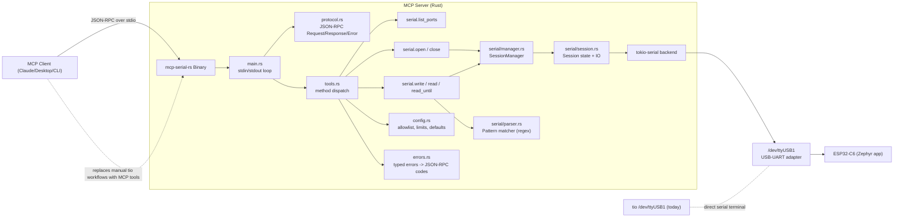
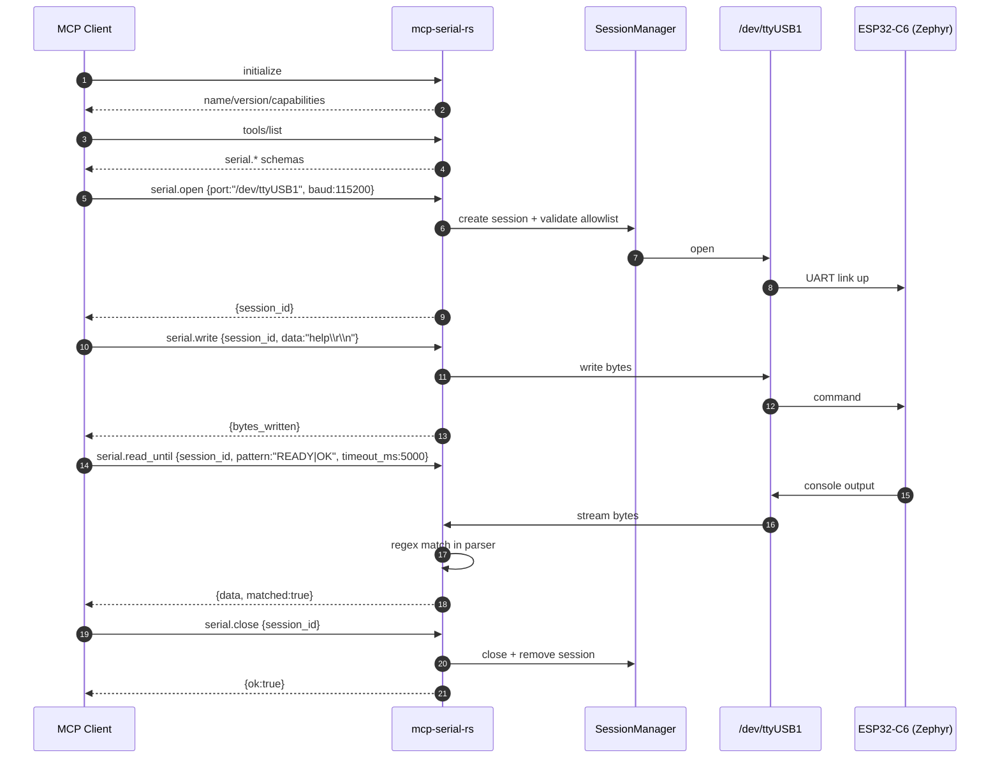

# MCP Serial Server Architecture (ESP32-C6 Focus)

This document captures the high-level architecture of `mcp-serial-rs` and its current target workflow around `/dev/ttyUSB1` for ESP32-C6 Zephyr bring-up/automation.

## System Overview

## Typical MCP Session

## Scope For Current Implementation

- Primary hardware path: ESP32-C6 over `/dev/ttyUSB1`.
- Primary objective: replace ad-hoc `tio` manual interaction with MCP-tool-driven, automatable serial workflows.
- Current umbrella methods:
- `initialize`
- `tools/list`
- `serial.list_ports`
- `serial.open`
- `serial.write`
- `serial.read`
- `serial.read_until`
- `serial.close`
