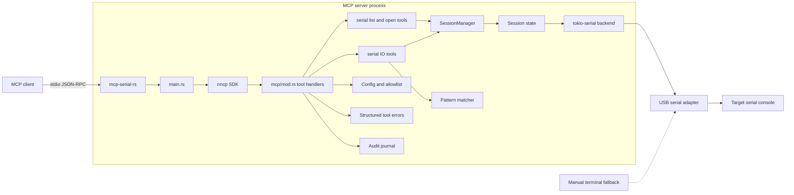
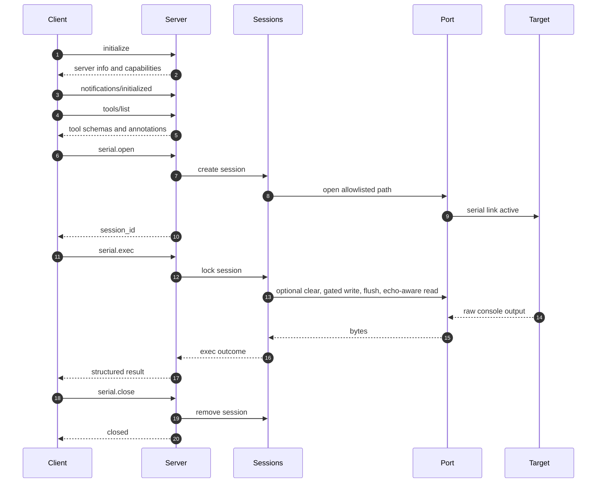

# MCP Serial Server Architecture

`mcp-serial-rs` is a hardware-neutral MCP server for local serial-console
access. It is intended for any allowlisted serial device path such as
`/dev/ttyUSB*`, `/dev/ttyACM*`, or a deployment-specific override. The current
server deliberately does not encode board-specific behavior into the protocol
surface.

Device profiles are optional local conveniences. They can name a known target,
pin USB VID/PID/serial matching, provide a default baud rate, and declare
bounded console-execution defaults. The tools still operate on generic serial
sessions, whose defaults preserve as-is writes.

## System Overview

The diagram intentionally avoids board names. The target may be a Linux console,
an RTOS shell, a bootloader prompt, a modem, an MCU monitor, or another serial
endpoint.

## Tool Boundary

The MCP adapter owns protocol concerns:

- lifecycle and `tools/list`/`tools/call` dispatch via `rmcp`;
- tool input and output schemas;
- tool annotations;
- conversion of serial-domain failures into MCP tool errors;
- audit-journal summaries.

The serial domain owns hardware behavior:

- session lifecycle;
- allowlist enforcement;
- port opening and close semantics;
- per-session locking;
- reads, writes, drains, and atomic exec;
- regex matching over accumulated serial output.

## Typical Session

`serial.exec` is a single manager-level operation. It holds the per-session port
lock across optional input clearing, command write, flush, and read-until. This
prevents another same-session request from consuming or injecting bytes between
a command and its expected response. The effective console settings are
captured on open. A non-`none` line ending is appended before the final size
check and the existing write-policy gate; line-echo mode delays regex matching
until after the echo boundary. A profile/global command policy is also captured
at open and gates the complete command before port checkout. Guarded sessions
refuse raw writes so policy matching cannot be bypassed by split input; see ADR
0007.

## Current Tool Surface

The current server exposes these tools:

- `serial.list_ports`
- `serial.open`
- `serial.sessions`
- `serial.get_session`
- `serial.write`
- `serial.read`
- `serial.drain`
- `serial.clear_input`
- `serial.read_until`
- `serial.exec`
- `serial.close`

All tools are advertised through `tools/list` with input schemas, output
schemas, descriptions, and annotations. The tool list is static.

## Error Model

JSON-RPC protocol errors are reserved for MCP framing, dispatch, unknown
methods/tools, and SDK deserialization failures.

Serial-domain failures inside a dispatched tool are MCP tool errors:

- the JSON-RPC response has a `result`;
- `result.isError` is `true`;
- `result.structuredContent.error` contains recovery fields such as error type,
  code, retryability, session id, whether a command was written, whether bytes
  were consumed, and whether the session remains usable.

## Raw Output Model

Serial output is untrusted device data. Tool results preserve raw lossy-UTF-8
output, including:

- command echo;
- prompts;
- CRLF line endings;
- line wrapping;
- ANSI escapes;
- OSC shell-integration sequences.

Normalization is explicit and additive. It may add a normalized field, but it
must not replace raw output. Profile-gated OSC 3008 parsing may additionally
surface bounded command output and status. It falls back without a status claim
when the markers are missing or ambiguous. See ADR 0006.

## Out of Scope

This server should remain a reliable serial-console capability. It should not
become a full HIL orchestrator. Keep these as separate systems or future
composed MCP servers:

- power switching;
- programmable PSU control;
- relay control;
- firmware flashing;
- SSH;
- test scheduling;
- artifact management;
- board reservation.
